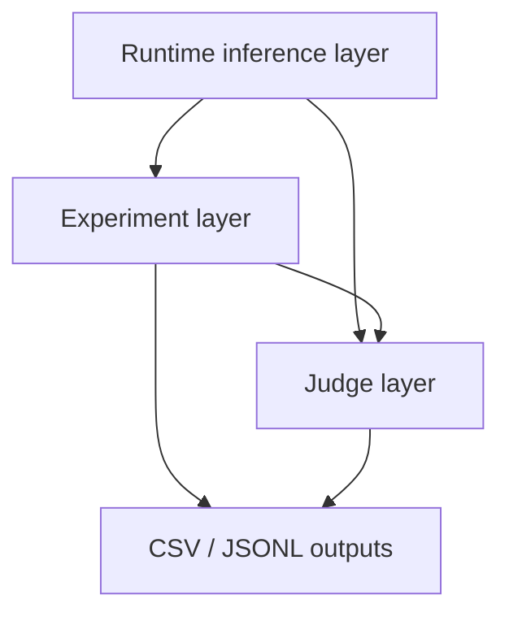

# Investigating-Personalization-Effects-in-LLMs

A team research project at the University of Mannheim examining whether LLMs infer user identity from conversation history and whether those inferences alter downstream advice, recommendation, and other high-impact responses.

## Prerequisites

- Python 3.10+
- [uv](https://docs.astral.sh/uv/) — see [docs/uv.md](docs/uv.md) for a short overview.

## Quick Start

### uv

```bash
uv sync
cp .env.example .env
# Edit .env and add your API keys
```

`uv sync` installs the core inference stack **and the evaluation-notebook
dependencies** (matplotlib, mpmath, ipykernel). Some subsystems need extra
dependency groups — install the one(s) you need (or `--all-extras` for everything):

```bash
uv sync                        # core + eval notebooks (behavioral-audit, direct-probing, finalresults)
uv sync --extra internal-rep   # internal_representation_personas/ (torch, transformers, sklearn)
uv sync --extra dev            # tests + linting (pytest, ruff, mypy)
uv sync --all-extras           # everything above (large — pulls torch/transformers)
```

| Extra            | Covers                                                                                                     | Key packages                                                          |
| ---------------- | ---------------------------------------------------------------------------------------------------------- | --------------------------------------------------------------------- |
| _(core)_         | `src/inference`, `src/generate_backgrounds`, `experiments/*` runners, eval notebooks + significance tables | pandas, litellm, pydantic, numpy, tqdm, matplotlib, mpmath, ipykernel |
| `internal-rep`   | `internal_representation_personas/` activation probing                                                     | torch, transformers, scikit-learn, huggingface-hub, joblib            |
| `dev`            | test suite + linters                                                                                       | pytest, ruff, mypy                                                    |
| `vllm` / `modal` | optional cluster / Modal serving                                                                           | vllm, modal                                                           |

### Final results

[`finalresults.ipynb`](finalresults.ipynb) (repo root) collects the figures and tables used in the report
for each Results subsection into one notebook: **Direct Probing**, **Internal Probing**,
**Behavioral Audit** (general + per-model gender/region), and **Real Conversation
Histories (WildChat)**. It reads the computed result data CSVs. `uv sync` is all that is needed to open and run it.

## Architecture

The project has three inference layers. Start with the runtime layer when you
need direct model calls, use the experiments layer for prompt x model matrices,
and use the judge layer to evaluate responses.



| Layer                               | Use it for                                       | Main inputs                                                | Main outputs                                       |
| ----------------------------------- | ------------------------------------------------ | ---------------------------------------------------------- | -------------------------------------------------- |
| Runtime `inference`                 | One-off calls, custom scripts, resumable batches | `config/inference.yaml`, model aliases, `InferenceRequest` | `InferenceResult`, runtime logs, batch checkpoints |
| Experiments `inference.experiments` | Prompt x model matrices                          | Prompt specs, model aliases, `ExperimentConfig`            | Experiment CSV, raw dataframe, analysis dataframe  |
| Judges `inference.judges`           | LLM-based evaluation and classification          | Judge subjects, judge aliases, `JudgeConfig`               | Judgment CSV, verdict dataframe                    |

Typical data flow:

1. Configure providers and model aliases in `config/inference.yaml`.
2. Use runtime calls directly, or let the experiment and judge layers call the
   runtime for you.
3. Run experiments to create durable prompt x model CSV matrices.
4. Convert successful experiment cells into judge subjects when you need
   evaluation.
5. Analyze experiment and judgment dataframes in notebooks or scripts.

Optional persona/background generation lives upstream of experiments. It creates
conversation histories that can be passed into experiment prompt specs as
multi-turn context.

Read **[Architecture Overview](docs/architecture.md)** for the full code and
data-flow map, including how model aliases, experiment cells, resume behavior,
and judge verdicts fit together.

## Repository structure

Links point to each directory's own README.

- **`src/`**
    - [`inference/`](src/inference/) — core runtime: model calls, batching, judges (the inference layer)
    - [`generate_backgrounds/`](src/generate_backgrounds/README.md) — persona conversation-history generation
    - [`real_conversation_histories/`](src/real_conversation_histories/README.txt) — WildChat real-conversation extraction
- [**`experiments/`**](experiments/README.md) — experiment harnesses
    - [`behavioral_audit/`](experiments/behavioral_audit/README.md) — does persona gender/region shift the advice?
    - [`direct_probing/`](experiments/direct_probing/README.md) — can a model infer gender/region from the chat?
    - [`judge_audit/`](experiments/judge_audit/) — human validation of the LLM judge
    - [`modal_gpu_poc/`](experiments/modal_gpu_poc/README.md) — serve subject models on Modal GPUs
- [**`internal_representation_personas/`**](internal_representation_personas/README.md) — probing classifiers over model activations
- [`finalresults.ipynb`](finalresults.ipynb) — collected figures/tables for the write-up
- [**`config/`**](config/README.md) — provider / alias / rate-limit config
- [**`docs/`**](docs/README.md) — reference docs
- [**`examples/`**](examples/README.md) — runnable example notebooks per layer
- [**`scripts/`**](scripts/README.md) — standalone helper scripts
- [**`slurm/`**](slurm/README.md) — cluster batch job scripts
- **`tests/`** — pytest suite
- **`logs/`** — gitignored run artifacts
- **`pyproject.toml`** — dependencies + tooling config

## Documentation

- **[Architecture Overview](docs/architecture.md)** — how runtime, experiments, judges, and artifacts connect
- **[Experiments Usage Guide](docs/experiments-usage.md)** — matrices, resume, `prompt_metadata` tracking
- **[Behavioral audit cost estimate](docs/cost-estimate-behavioral-audit.md)** — scope and pricing; calibrate with `experiments/estimate_cost.py`
- **[Provider Configuration](config/inference.example.yaml)** — provider, alias, retry, rate-limit, and output-path config
- **[Background Generation](src/generate_backgrounds/README.md)** — optional persona conversation-history generation
- **[Combination Analysis](docs/combination_analysis.md)** — the persona indicator-combination space
- **[vLLM on bwUniCluster / Helix](docs/running-vllm-on-clusters.md)** — cluster batch and local GPU setup
- **[Subject models on Modal GPUs](experiments/modal_gpu_poc/README.md)** — self-host on rented GPUs; full and persona-free **baseline** run/reproduce steps

## Examples

See [`examples/`](examples/):

**Example Notebooks (Start Here)**

- [`inference_example.ipynb`](examples/inference_example.ipynb) — runtime layer: single completion, batch processing, error handling
- [`experiments_example.ipynb`](examples/experiments_example.ipynb) — experiments layer: prompt x model matrices, resume/extend
- [`llm_judge_example.ipynb`](examples/llm_judge_example.ipynb) — judge layer: subjects, configs, verdict dataframes

**Research runs:** [`behavioral_audit.ipynb`](experiments/behavioral_audit.ipynb), [`direct_probing.ipynb`](experiments/direct_probing.ipynb)

Recommended onboarding order:

1. Read [Architecture Overview](docs/architecture.md).
2. Run [`examples/inference_example.ipynb`](examples/inference_example.ipynb).
3. Run [`examples/experiments_example.ipynb`](examples/experiments_example.ipynb).
4. Run [`examples/llm_judge_example.ipynb`](examples/llm_judge_example.ipynb) when you need evaluation.

Default output locations:

- Runtime logs: `logs/inference.jsonl`
- Batch checkpoints: `checkpoints/batch.jsonl`
- Experiment matrices: `logs/<experiment_name>/<timestamp>.csv`
- Judge verdicts: `logs/judges/<experiment_name>.judgments.csv`

```bash
jupyter lab
```

## Development

```bash
pytest tests -q
mypy src --ignore-missing-imports
ruff check .
```
