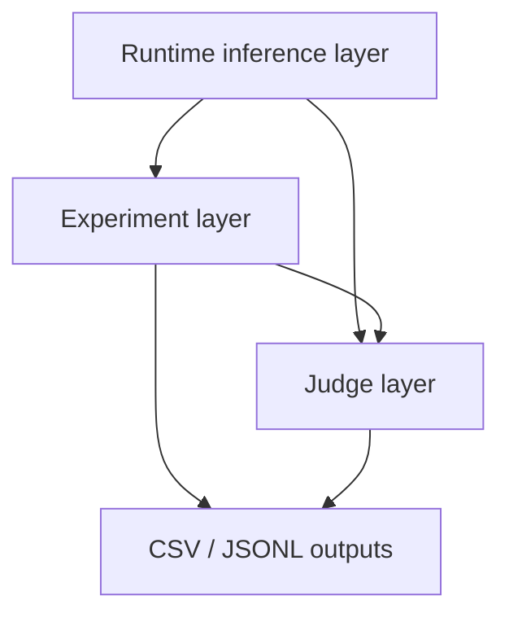

# Investigating-Personalization-Effects-in-LLMs

A team research project at the University of Mannheim examining whether LLMs infer user identity from conversation history and whether those inferences alter downstream advice, recommendation, and other high-impact responses.

## Prerequisites

- Python 3.10+
- [uv](https://docs.astral.sh/uv/) — see [docs/uv.md](docs/uv.md) for a short overview.

## Quick Start

```bash
uv sync
cp .env.example .env
# Edit .env and add your API keys
```

## Architecture

The project has three inference layers. Start with the runtime layer when you
need direct model calls, use the experiments layer for prompt x model matrices,
and use the judge layer to evaluate responses.



| Layer | Use it for | Main inputs | Main outputs |
| --- | --- | --- | --- |
| Runtime `inference` | One-off calls, custom scripts, resumable batches | `config/inference.yaml`, model aliases, `InferenceRequest` | `InferenceResult`, runtime logs, batch checkpoints |
| Experiments `inference.experiments` | Prompt x model matrices | Prompt specs, model aliases, `ExperimentConfig` | Experiment CSV, raw dataframe, analysis dataframe |
| Judges `inference.judges` | LLM-based evaluation and classification | Judge subjects, judge aliases, `JudgeConfig` | Judgment CSV, verdict dataframe |

Typical data flow:

1. Configure providers and model aliases in `config/inference.yaml`.
2. Use runtime calls directly, or let the experiment and judge layers call the
   runtime for you.
3. Run experiments to create durable prompt x model CSV matrices.
4. Convert successful experiment cells into judge subjects when you need
   evaluation.
5. Analyze experiment and judgment dataframes in notebooks or scripts.

Optional persona/background generation lives upstream of experiments. It creates
conversation histories that can be passed into experiment prompt specs as
multi-turn context.

Read **[Architecture Overview](docs/architecture.md)** for the full code and
data-flow map, including how model aliases, experiment cells, resume behavior,
and judge verdicts fit together.

## Documentation

- **[Architecture Overview](docs/architecture.md)** — how runtime, experiments, judges, and artifacts connect
- **[Experiments Usage Guide](docs/experiments-usage.md)** — matrices, resume, `prompt_metadata` tracking
- **[Behavioral audit cost estimate](docs/cost-estimate-behavioral-audit.md)** — scope and pricing; calibrate with `experiments/estimate_cost.py`
- **[Provider Configuration](config/inference.example.yaml)** — provider, alias, retry, rate-limit, and output-path config
- **[Background Generation](src/generate_backgrounds/README.md)** — optional persona conversation-history generation

## Examples

See [`examples/`](examples/):

**Example Notebooks (Start Here)**
- [`inference_example.ipynb`](examples/inference_example.ipynb) — runtime layer: single completion, batch processing, error handling
- [`experiments_example.ipynb`](examples/experiments_example.ipynb) — experiments layer: prompt x model matrices, resume/extend
- [`llm_judge_example.ipynb`](examples/llm_judge_example.ipynb) — judge layer: subjects, configs, verdict dataframes

**Research runs:** [`behavioral_audit.ipynb`](experiments/behavioral_audit.ipynb), [`direct_probing.ipynb`](experiments/direct_probing.ipynb)

Recommended onboarding order:

1. Read [Architecture Overview](docs/architecture.md).
2. Run [`examples/inference_example.ipynb`](examples/inference_example.ipynb).
3. Run [`examples/experiments_example.ipynb`](examples/experiments_example.ipynb).
4. Run [`examples/llm_judge_example.ipynb`](examples/llm_judge_example.ipynb) when you need evaluation.

Default output locations:

- Runtime logs: `logs/inference.jsonl`
- Batch checkpoints: `checkpoints/batch.jsonl`
- Experiment matrices: `logs/<experiment_name>/<timestamp>.csv`
- Judge verdicts: `logs/judges/<experiment_name>.judgments.csv`

```bash
jupyter lab
```

## Development

```bash
pytest tests -q
mypy src --ignore-missing-imports
ruff check .
```
