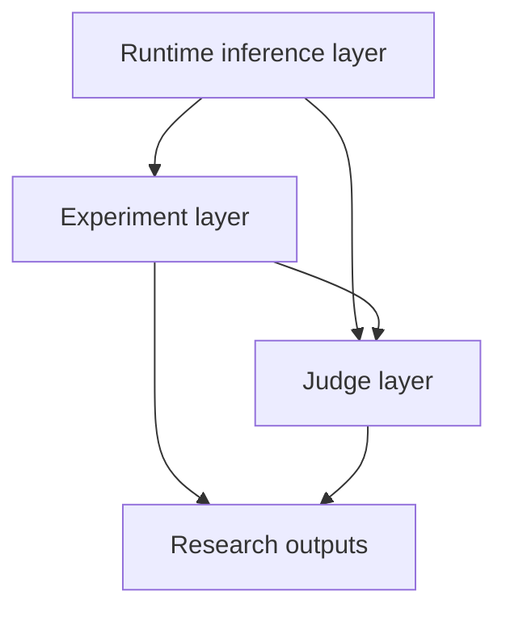
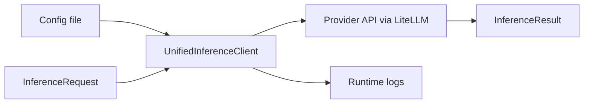
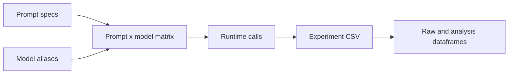
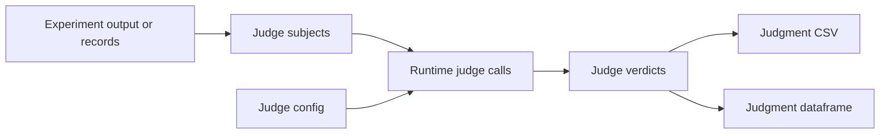
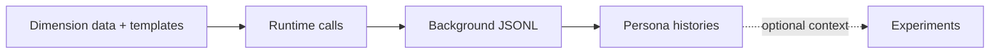

# Architecture Overview

This project has one shared runtime for LLM calls and two higher-level research
layers built on top of it:

- `inference`: low-level runtime for configured model calls, retries, rate limits,
  logging, and batch checkpointing.
- `inference.experiments`: prompt x model matrix runner with CSV persistence,
  resume/extend behavior, and dataframe helpers.
- `inference.judges`: LLM-as-a-judge runner for evaluating model outputs or
  arbitrary records with resumable judgment CSVs.

`generate_backgrounds` is a supporting data-preparation pipeline. It can create
persona conversation histories that later become experiment prompt context, but
it is not a fourth inference layer.

Use this document to understand how code and data move through the project before
running the notebooks. For task-focused experiment instructions, use
[Experiments Usage Guide](experiments-usage.md).

Recommended onboarding route:

1. Read this architecture overview.
2. Run the runtime notebook:
   [`examples/inference_example.ipynb`](../examples/inference_example.ipynb).
3. Run the experiment notebook:
   [`examples/experiments_example.ipynb`](../examples/experiments_example.ipynb).
4. Run the judge notebook when you need evaluation:
   [`examples/llm_judge_example.ipynb`](../examples/llm_judge_example.ipynb).

## At a Glance

Read this diagram as the mental model for the repo:

- The **runtime layer** knows how to call configured model providers.
- The **experiment layer** uses the runtime to create prompt x model result matrices.
- The **judge layer** uses the runtime to evaluate subjects, often from experiment outputs.
- **Research outputs** are durable CSV/JSONL files and dataframes used for analysis.

Optional persona/background generation sits upstream of experiments. It produces
message histories that can be used as experiment prompts, but it does not change
the three-layer inference model.

## Core Concepts

| Concept | Where | Meaning |
| --- | --- | --- |
| Provider | `config/inference.yaml` | A backend such as `openai`, `anthropic`, `openrouter`, `vllm`, `modal`, or `mock`. |
| Model alias | `config/inference.yaml` | Stable project-local name that maps to a provider model id. |
| `InferenceRequest` | `inference` | One low-level request: alias, prompt or messages, optional generation settings and tools. |
| `InferenceResult` | `inference` | One provider response plus model metadata, token counts, latency, retries, and tool calls. |
| Prompt id | `inference.experiments` | SHA-256 hash of the canonical prompt JSON. It is the stable row key in experiment CSVs. |
| Experiment cell | `inference.experiments` | One `(prompt_id, model_alias)` result with status, response, error, and metadata. |
| Judge subject | `inference.judges` | One item to evaluate, either text content or a message transcript. |
| Judge verdict | `inference.judges` | One `(subject, judge)` output with status, raw output, parsed class, tokens, latency, and metadata. |

## Runtime Layer

Use the runtime layer when you need one direct model call, a custom loop, or a
batch pipeline that does not fit prompt x model matrix semantics.

Primary entry points:

- `create_client(config_path)` loads YAML config and returns a `UnifiedInferenceClient`.
- `run_completion(client, request)` executes one `InferenceRequest`.
- `run_batch(config_path, requests)` runs an async request stream with checkpointing.

Runtime data flow:

Important behavior:

- Model aliases are the boundary between research code and vendor model ids.
- Provider rate limits and concurrency are configured in YAML, not in notebooks.
- Runtime logs are metadata-oriented JSONL records at `logs/inference.jsonl` by default.
- Batch checkpoints are append-only JSONL records at `checkpoints/batch.jsonl` by default.
- Some models do not support system messages. The provider adapter folds system
  content into the first user message for known affected models and returns
  metadata so experiment results remain traceable.

Runtime artifacts:

| Artifact | Purpose |
| --- | --- |
| `logs/inference.jsonl` | Per-request success/failure metadata for runtime calls. |
| `checkpoints/batch.jsonl` | Batch resume state for `run_batch(...)`. |

## Experiment Layer

Use the experiment layer for normal research runs where you want rows of prompts
crossed with columns of model aliases.

Primary entry points:

- `ExperimentConfig` defines `experiment_name`, `model_aliases`, prompts, retry,
  scheduling, system prompts, tools, sparse cells, and resume behavior.
- `ExperimentRunner(client).run(config)` executes the matrix and returns an
  `ExperimentResult`.
- `build_experiment_grid(...)` generates prompt grids.
- `build_dataframe_from_csv(...)`, `filter_experiment_dataframe(...)`, and
  `to_analysis_dataframe(...)` support analysis.

Experiment data flow:

CSV contract:

- Columns are `prompt_id`, `prompt`, then one column per model alias.
- The `prompt` column stores canonical prompt JSON.
- Each model cell stores JSON with `status`, optional `response`, optional
  `error_message`, and optional `metadata`.
- Terminal statuses are `success`, `failed`, `rate_limited`, and `not_requested`.
- Sparse grids write `not_requested` for cells outside `run_cells`.

Resume behavior:

- Resume keeps successful cells.
- Missing, failed, and rate-limited cells are rerun.
- Newly added prompts are appended.
- Removed prompts are trimmed from the resumed CSV.
- If no work remains, the runner loads the CSV and returns without calling providers.

Experiment artifacts:

| Artifact | Purpose |
| --- | --- |
| `logs/<experiment_name>/<timestamp>.csv` | Source of truth for the prompt x model matrix. |
| `logs/<experiment_name>/<timestamp>.csv.meta.json` | Schema sidecar for model aliases, status values, and identity rules. |

## Judge Layer

Use the judge layer when you need LLM-based evaluation, classification, or rubric
judgment over model outputs or arbitrary records.

Primary entry points:

- `JudgeConfig` defines the judge model aliases, rubric prompt, optional classes,
  output directory, resume behavior, and generation settings.
- `JudgeExecutionConfig` controls timeout and per-judge worker counts.
- `run_judges(client, subjects, config, execution)` runs one call for each
  `(subject, judge)` row.
- `ExperimentDataFrameAdapter` turns successful experiment cells into judge subjects.
- `GenericRecordsAdapter` and `subjects_from_dataframe(...)` turn tabular records
  into judge subjects.

Judge data flow:

Important behavior:

- Each `(subject, judge)` row triggers exactly one LLM call.
- When `classes` is set, the prompt requires a
  `<final_answer>LABEL</final_answer>` sentinel.
- Parser misses become `classification_failed`; provider/runtime failures become
  `call_failed`.
- Resume skips only rows already marked `success` for the same semantic
  `JudgeConfig` hash.
- Judge queues run independently, so one failing judge does not block another.

Judge artifacts:

| Artifact | Purpose |
| --- | --- |
| `logs/judges/<experiment_name>.judgments.csv` | Source of truth for judge verdicts and resume state. |
| `JudgeResult.dataframe` | Analysis-friendly dataframe built from verdict rows. |

## Supporting Pipeline: Background Generation

`generate_backgrounds` creates persona-related conversation histories for
personalization experiments.

High-level flow:

Use `src/generate_backgrounds/README.md` for the pipeline details. The important
architecture point is that its output is data: assembled message histories can be
fed into experiment prompt specs as multi-turn context.

## Which Entry Point Should I Use?

| Goal | Use |
| --- | --- |
| Call one model from a script or notebook | `create_client` + `run_completion` |
| Run a custom async stream of requests with resume checkpoints | `run_batch` |
| Compare several prompts across several model aliases | `ExperimentRunner` |
| Resume, extend, or analyze a prompt x model matrix | `inference.experiments` dataframe helpers |
| Evaluate model outputs with one or more LLM judges | `run_judges` |
| Convert experiment outputs into judge inputs | `ExperimentDataFrameAdapter` |
| Generate persona conversation histories | `python -m generate_backgrounds` |

## Files To Read Next

- [README.md](../README.md): short project overview and onboarding route.
- [config/inference.example.yaml](../config/inference.example.yaml): provider, alias, retry, rate-limit, and path schema.
- [examples/inference_example.ipynb](../examples/inference_example.ipynb): runtime layer examples.
- [examples/experiments_example.ipynb](../examples/experiments_example.ipynb): experiment layer examples.
- [examples/llm_judge_example.ipynb](../examples/llm_judge_example.ipynb): judge layer examples.
- [docs/experiments-usage.md](experiments-usage.md): experiment API and CSV usage reference.
- [src/generate_backgrounds/README.md](../src/generate_backgrounds/README.md): optional persona/background generation pipeline.
